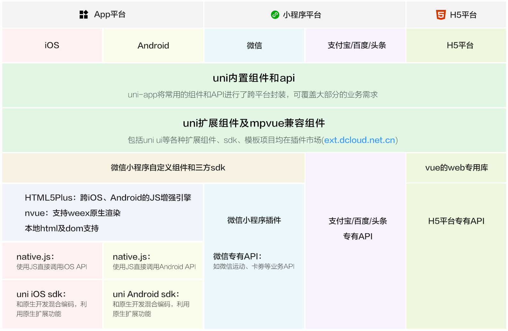

# uni-app

## 1 简介及快速入门

### 1.1 简介

`uni-app` 是使用 [Vue.js](https://vuejs.org/) 开发**跨平台**应用的前端框架，一套代码可编译到iOS、Android、H5、小程序等多个平台。功能框架：



`uni-app`支持通过 `HBuilderX`可视化界面（内置相关环境，开箱即用，无需配置nodejs）、`vue-cli`命令行两种方式快速创建项目。HbuilderX安装、微信开发者工具安装（端口设置）、运行发布等，[查阅uni-app官网](https://uniapp.dcloud.io/)及微信开发者工具设置。

`uni-app`产品特征：

* 跨平台：“一套代码，多端运行”；条件编译，不牺牲平台特色，可优雅的调用平台专有能力

  ```vue
  <template>
  <view class="content">
      <!-- 若是微信端，则编译如下代码 -->
      <!-- #ifdef MP-WEIXIN -->
      hello weixin<br/>
      <!-- #endif -->
      <!-- 若不是app端，则编译如下代码 -->
      <!-- #ifndef APP-PLUS -->
      hello app
      <!-- #endif -->
      </view>
  </template>
  ```

  

* 运行体验好：兼容 weex 原生渲染

* 通用技术栈：**Vue 的语法；微信小程序的 api 和组件**；内嵌 mpvue

* 开放生态，组件丰富：略

### 1.2 快速入门

> 通过[快速上手](https://uniapp.dcloud.io/quickstart)，亲身体验下uni-app